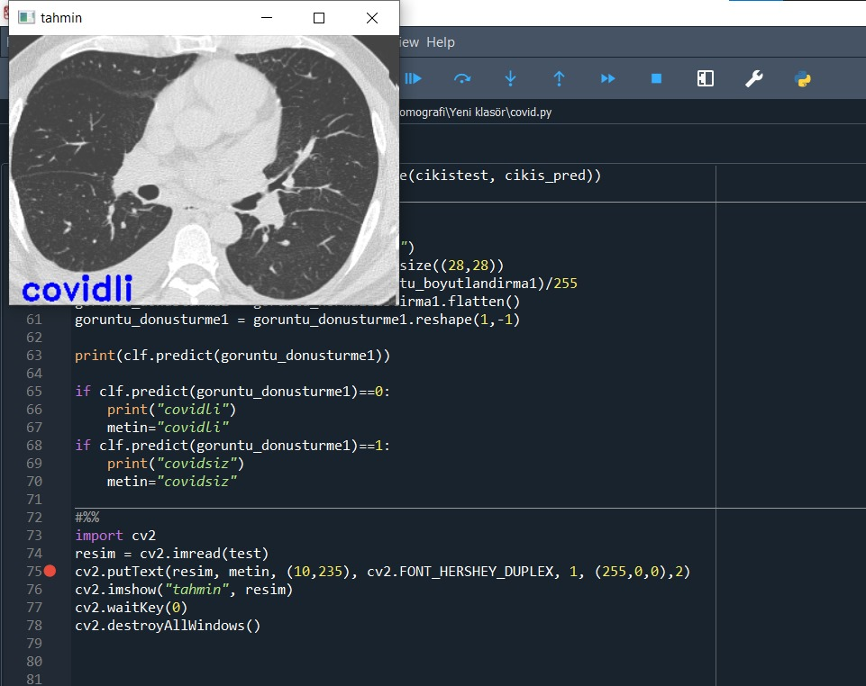

<h1>MachineLearning_Step4_Data_Projects</h1>

### 1) Image_Process_Logistic_Regression

Bu proje, görüntü işleme teknikleri ve lojistik regresyon kullanılarak bir görsel sınıflandırma modeli oluşturmayı amaçlar.

This project aims to create a visual classification model using image processing techniques and logistic regression.

### 2) Cancer_Project_Decision_Tree

Bu proje, kanser sınıflandırma problemi için bir karar ağacı modeli oluşturmayı amaçlar.

This project aims to build a decision tree model for cancer classification.

### 3) Tomography_Covid_Project_Decision_Tree

Bu proje, tomografi görüntüleri kullanılarak COVID-19 teşhisi yapmak için bir karar ağacı modeli oluşturmayı amaçlar.

This project aims to create a decision tree model for diagnosing COVID-19 using tomography images.

### 4) Diabetes_Web_Project_kNN

Bu proje, web tabanlı bir uygulama aracılığıyla k-NN algoritması kullanılarak diabetes (şeker hastalığı) tahmini yapmayı amaçlar. Projeyi çalıştırdıktan sonra http://127.0.0.1:5001/ adresine giderek istenilen değerlerin girilmesi sonucunda istenen sonuçları görüntüleyebilirsiniz. Çok basit bir tasarımdır isteğinize göre siteyi şekillendirebilirsiniz.

This project aims to make diabetes predictions through a web-based application using the k-NN algorithm. After running the project, you can visit http://127.0.0.1:5001/ to input values and view the predicted results. The design is minimal, and you can customize the site according to your preferences.

### 5) Titanic_Project

Bu proje, ünlü Titanic veri kümesi üzerinde bir makine öğrenimi modeli oluşturmayı amaçlar.

This project aims to build a machine learning model on the famous Titanic dataset.

