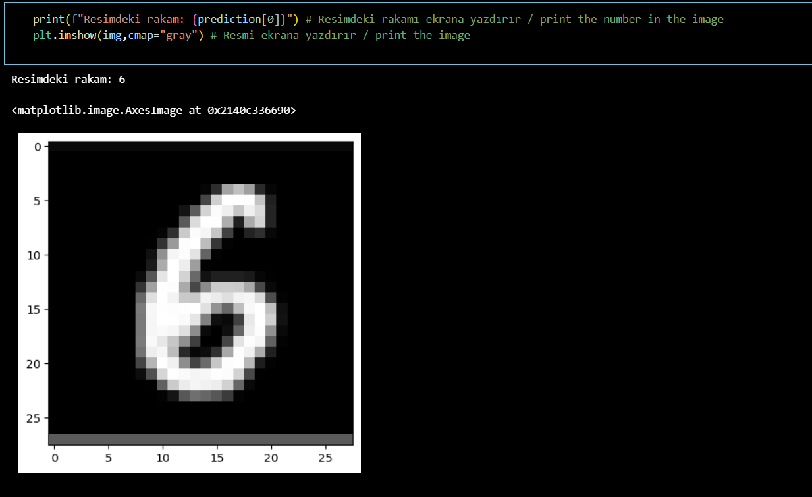
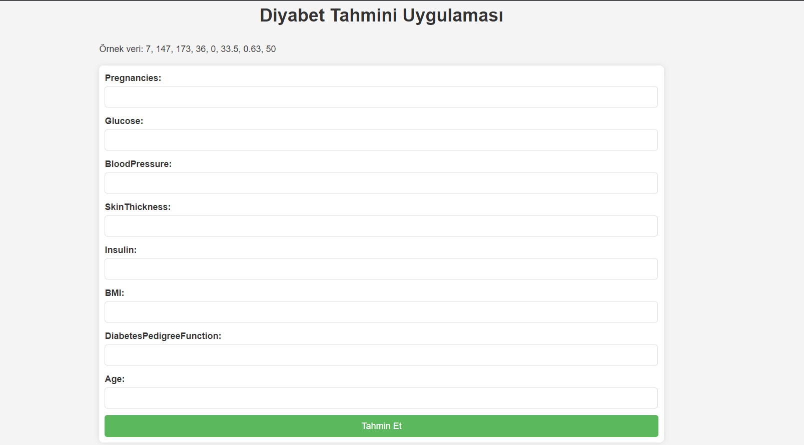

<h1>MachineLearning_Step4_Data_Projects</h1>

1) Image_Process_Logistic_Regression
Proje Açıklaması:
Bu proje, görüntü işleme teknikleri ve lojistik regresyon kullanılarak bir görsel sınıflandırma modeli oluşturmayı amaçlar.

3) Cancer_Project_Decision_Tree

Proje Açıklaması:
Bu proje, kanser sınıflandırma problemi için bir karar ağacı modeli oluşturmayı amaçlar.

3) Tomography_Covid_Project_Decision_Tree
Proje Açıklaması:
Bu proje, tomografi görüntüleri kullanılarak COVID-19 teşhisi yapmak için bir karar ağacı modeli oluşturmayı amaçlar.

4) Diabetes_Web_Project_kNN
Proje Açıklaması:
Bu proje, web tabanlı bir uygulama aracılığıyla k-NN algoritması kullanılarak diabetes (şeker hastalığı) tahmini yapmayı amaçlar. Projeyi çalıştırdıktan sonra http://127.0.0.1:5001/ adresine giderek istenilen değerlerin girilmesi sonucunda istenen sonuçları görüntüleyebilirsiniz. Çok basit bir tasarımdır isteğinize göre siteyi şekillendirebilirsiniz.

5) Titanic_Project
Proje Açıklaması:
Bu proje, ünlü Titanic veri kümesi üzerinde bir makine öğrenimi modeli oluşturmayı amaçlar.

